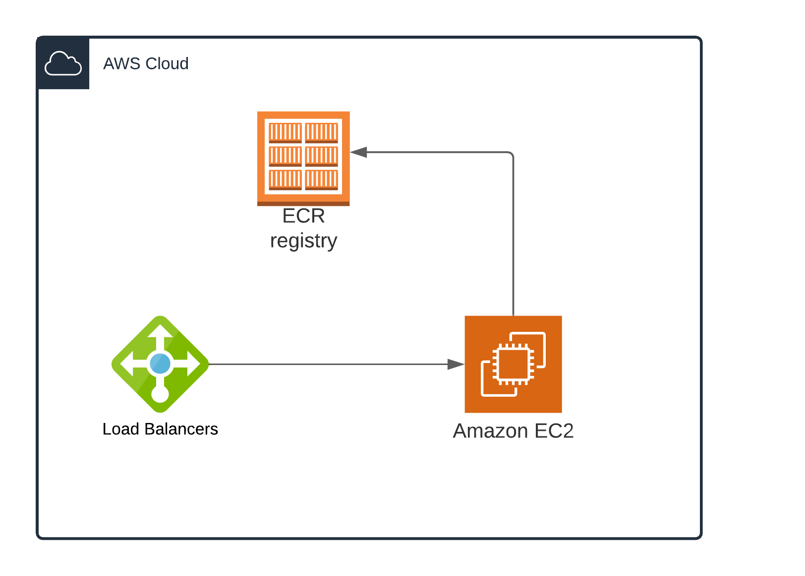

# Wallet mono repo

This is a monorepo contianing wallet POC. This monorepo is build into a docker compose stack with a nginx front end. Please refer to `docker-compose.yml` for details

Directories

```bash

├── nginx <--- Proxy for docker compose start point
├── terraform <--- Terraform scripts
├── wallet <--- React wallet app
└── wallet-api <--- Api 

```

## Build

Make sure aws cli and profile is setup. <https://docs.aws.amazon.com/cli/latest/userguide/getting-started-install.html>.

All command are in `makefile`

Update following env variables

```bash
export REGION
export ECR_REPO_URL
```

### Commands Summary

Create ECR repos

```bash
make ecr
```

Run localhost

```bash
make 
```

### Build and deploy to aws



Following command will create infrasturcture and deploy to aws.
Make sure you have updated the terraform variables.
Create a Key/Pair called `ec2_key` in aws console.

```bash
make ecr build deploy
```

Redeploy command

```bash
make redeploy
```
